# Docker Mastery Dependency Map

این فایل از prerequisites صریح syllabus v1.1.0 مشتق شده و برای visual/reference mapping است. Source of Truth خود syllabus است.

```mermaid
flowchart TD
  META_DKR_02["META.DKR.02"] --> META_DKR_03["META.DKR.03"]
  META_DKR_01["META.DKR.01"] --> DKR_01["DKR.01"]
  DKR_01["DKR.01"] --> DKR_02["DKR.02"]
  META_DKR_02["META.DKR.02"] --> DKR_02["DKR.02"]
  DKR_01["DKR.01"] --> DKR_03["DKR.03"]
  DKR_02["DKR.02"] --> DKR_03["DKR.03"]
  DKR_03["DKR.03"] --> DKR_04["DKR.04"]
  DKR_04["DKR.04"] --> DKR_05["DKR.05"]
  DKR_05["DKR.05"] --> DKR_06["DKR.06"]
  DKR_05["DKR.05"] --> DKR_07["DKR.07"]
  DKR_05["DKR.05"] --> DKR_08["DKR.08"]
  DKR_04["DKR.04"] --> DKR_09["DKR.09"]
  DKR_09["DKR.09"] --> DKR_10["DKR.10"]
  DKR_09["DKR.09"] --> DKR_11["DKR.11"]
  DKR_11["DKR.11"] --> DKR_12["DKR.12"]
  DKR_11["DKR.11"] --> DKR_13["DKR.13"]
  DKR_12["DKR.12"] --> DKR_13["DKR.13"]
  DKR_13["DKR.13"] --> DKR_14["DKR.14"]
  DKR_14["DKR.14"] --> DKR_15["DKR.15"]
  DKR_09["DKR.09"] --> DKR_16["DKR.16"]
  DKR_15["DKR.15"] --> DKR_16["DKR.16"]
  DKR_14["DKR.14"] --> DKR_17["DKR.17"]
  DKR_14["DKR.14"] --> DKR_18["DKR.18"]
  DKR_16["DKR.16"] --> DKR_18["DKR.18"]
  DKR_09["DKR.09"] --> DKR_19["DKR.19"]
  DKR_10["DKR.10"] --> DKR_19["DKR.19"]
  DKR_08["DKR.08"] --> DKR_20["DKR.20"]
  DKR_09["DKR.09"] --> DKR_21["DKR.21"]
  DKR_20["DKR.20"] --> DKR_21["DKR.21"]
  DKR_21["DKR.21"] --> DKR_22["DKR.22"]
  DKR_14["DKR.14"] --> DKR_22["DKR.22"]
  DKR_04["DKR.04"] --> DKR_23["DKR.23"]
  DKR_23["DKR.23"] --> DKR_24["DKR.24"]
  DKR_23["DKR.23"] --> DKR_25["DKR.25"]
  DKR_24["DKR.24"] --> DKR_25["DKR.25"]
  DKR_23["DKR.23"] --> DKR_26["DKR.26"]
  DKR_24["DKR.24"] --> DKR_27["DKR.27"]
  DKR_25["DKR.25"] --> DKR_27["DKR.27"]
  DKR_05["DKR.05"] --> DKR_28["DKR.28"]
  DKR_20["DKR.20"] --> DKR_28["DKR.28"]
  DKR_23["DKR.23"] --> DKR_28["DKR.28"]
  DKR_28["DKR.28"] --> DKR_29["DKR.29"]
  DKR_03["DKR.03"] --> DKR_30["DKR.30"]
  META_DKR_02["META.DKR.02"] --> DKR_30["DKR.30"]
  DKR_30["DKR.30"] --> DKR_31["DKR.31"]
  META_DKR_03["META.DKR.03"] --> DKR_31["DKR.31"]
  DKR_05["DKR.05"] --> DKR_32["DKR.32"]
  DKR_30["DKR.30"] --> DKR_32["DKR.32"]
  DKR_06["DKR.06"] --> DKR_33["DKR.33"]
  DKR_07["DKR.07"] --> DKR_33["DKR.33"]
  DKR_33["DKR.33"] --> DKR_34["DKR.34"]
  DKR_18["DKR.18"] --> DKR_35["DKR.35"]
  DKR_19["DKR.19"] --> DKR_35["DKR.35"]
  DKR_33["DKR.33"] --> DKR_35["DKR.35"]
  DKR_19["DKR.19"] --> DKR_36["DKR.36"]
  DKR_35["DKR.35"] --> DKR_36["DKR.36"]
  DKR_23["DKR.23"] --> DKR_37["DKR.37"]
  DKR_30["DKR.30"] --> DKR_37["DKR.37"]
  DKR_37["DKR.37"] --> DKR_38["DKR.38"]
  DKR_26["DKR.26"] --> DKR_38["DKR.38"]
  DKR_03["DKR.03"] --> DKR_39["DKR.39"]
  DKR_30["DKR.30"] --> DKR_39["DKR.39"]
  DKR_33["DKR.33"] --> DKR_39["DKR.39"]
  DKR_06["DKR.06"] --> LNX_01["LNX.01"]
  LNX_01["LNX.01"] --> LNX_02["LNX.02"]
  LNX_02["LNX.02"] --> LNX_03["LNX.03"]
  LNX_01["LNX.01"] --> LNX_04["LNX.04"]
  LNX_01["LNX.01"] --> LNX_05["LNX.05"]
  LNX_02["LNX.02"] --> LNX_05["LNX.05"]
  LNX_05["LNX.05"] --> LNX_06["LNX.06"]
  DKR_21["DKR.21"] --> LNX_06["LNX.06"]
  LNX_01["LNX.01"] --> LNX_07["LNX.07"]
  LNX_07["LNX.07"] --> LNX_08["LNX.08"]
  LNX_01["LNX.01"] --> LNX_09["LNX.09"]
  LNX_03["LNX.03"] --> LNX_09["LNX.09"]
  LNX_04["LNX.04"] --> LNX_10["LNX.10"]
  DKR_30["DKR.30"] --> LNX_10["LNX.10"]
  DKR_09["DKR.09"] --> OCI_01["OCI.01"]
  LNX_06["LNX.06"] --> OCI_01["OCI.01"]
  LNX_02["LNX.02"] --> OCI_02["OCI.02"]
  LNX_04["LNX.04"] --> OCI_02["OCI.02"]
  LNX_05["LNX.05"] --> OCI_02["OCI.02"]
  LNX_09["LNX.09"] --> OCI_02["OCI.02"]
  DKR_19["DKR.19"] --> OCI_03["OCI.03"]
  OCI_01["OCI.01"] --> OCI_03["OCI.03"]
  OCI_01["OCI.01"] --> OCI_04["OCI.04"]
  OCI_03["OCI.03"] --> OCI_04["OCI.04"]
  OCI_01["OCI.01"] --> CTR_01["CTR.01"]
  OCI_02["OCI.02"] --> CTR_01["CTR.01"]
  CTR_01["CTR.01"] --> CTR_02["CTR.02"]
  CTR_01["CTR.01"] --> CTR_03["CTR.03"]
  OCI_02["OCI.02"] --> CTR_03["CTR.03"]
  OCI_02["OCI.02"] --> RNC_01["RNC.01"]
  CTR_03["CTR.03"] --> RNC_01["RNC.01"]
  RNC_01["RNC.01"] --> RNC_02["RNC.02"]
  LNX_02["LNX.02"] --> RNC_02["RNC.02"]
  DKR_03["DKR.03"] --> SRC_MOB_01["SRC.MOB.01"]
  CTR_03["CTR.03"] --> SRC_MOB_01["SRC.MOB.01"]
  RNC_01["RNC.01"] --> SRC_MOB_01["SRC.MOB.01"]
  SRC_MOB_01["SRC.MOB.01"] --> SRC_MOB_02["SRC.MOB.02"]
  DKR_03["DKR.03"] --> SRC_CLI_01["SRC.CLI.01"]
  META_DKR_03["META.DKR.03"] --> SRC_CLI_01["SRC.CLI.01"]
  DKR_14["DKR.14"] --> SRC_BLD_01["SRC.BLD.01"]
  CTR_02["CTR.02"] --> SRC_BLD_01["SRC.BLD.01"]
  DKR_28["DKR.28"] --> SRC_CMP_01["SRC.CMP.01"]
  LNX_02["LNX.02"] --> LAB_01["LAB.01"]
  LNX_04["LNX.04"] --> LAB_01["LAB.01"]
  LNX_05["LNX.05"] --> LAB_01["LAB.01"]
  LNX_08["LNX.08"] --> LAB_01["LAB.01"]
  LNX_09["LNX.09"] --> LAB_01["LAB.01"]
  OCI_01["OCI.01"] --> LAB_02["LAB.02"]
  OCI_03["OCI.03"] --> LAB_02["LAB.02"]
  CTR_02["CTR.02"] --> LAB_02["LAB.02"]
  LNX_08["LNX.08"] --> LAB_03["LAB.03"]
  DKR_02["DKR.02"] --> PLT_01["PLT.01"]
  LNX_10["LNX.10"] --> PLT_01["PLT.01"]
  PLT_01["PLT.01"] --> PLT_02["PLT.02"]
  DKR_19["DKR.19"] --> PLT_03["PLT.03"]
  DKR_35["DKR.35"] --> PLT_03["PLT.03"]
  OCI_04["OCI.04"] --> PLT_04["PLT.04"]
  PLT_01["PLT.01"] --> PLT_04["PLT.04"]
  DKR_30["DKR.30"] --> OPS_01["OPS.01"]
  DKR_32["DKR.32"] --> OPS_01["OPS.01"]
  DKR_35["DKR.35"] --> OPS_01["OPS.01"]
  DKR_07["DKR.07"] --> OPS_02["OPS.02"]
  DKR_21["DKR.21"] --> OPS_02["OPS.02"]
  DKR_24["DKR.24"] --> OPS_02["OPS.02"]
  OPS_01["OPS.01"] --> OPS_03["OPS.03"]
  CTR_03["CTR.03"] --> OPS_04["OPS.04"]
  RNC_01["RNC.01"] --> OPS_04["OPS.04"]
  SRC_MOB_01["SRC.MOB.01"] --> CONTRIB_01["CONTRIB.01"]
  SRC_BLD_01["SRC.BLD.01"] --> CONTRIB_01["CONTRIB.01"]
  OPS_03["OPS.03"] --> INT_01["INT.01"]
  INT_01["INT.01"] --> INT_02["INT.02"]
  CONTRIB_01["CONTRIB.01"] --> CAP_01["CAP.01"]
  INT_02["INT.02"] --> CAP_01["CAP.01"]
```

## Cross-stack chains

- Docker run -> CLI -> Engine API -> dockerd/Moby -> containerd -> shim -> runc -> OCI runtime -> Linux primitives
- Build -> Dockerfile frontend -> LLB -> BuildKit solver/worker/snapshotter -> OCI image -> Distribution/registry
- Bridge network -> netns -> veth -> Linux bridge -> routing/IP forwarding -> netfilter/NAT/conntrack
- Resource limit -> Docker config -> OCI resources -> runc/libcontainer -> cgroup v2 -> kernel
- Rootless -> user namespace -> ID mapping -> rootless network/storage/cgroup delegation -> daemon/container processes
